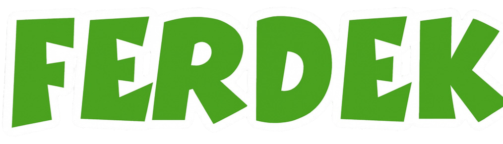

A humorous programming language based on the Polish sitcom "Świat według Kiepskich", implemented in OCaml.

## VS Code Extension

There's a [VS Code extension](https://github.com/kupolak/ferdek-vscode) with syntax highlighting, auto-completion, and snippets. Get it from the [marketplace](https://marketplace.visualstudio.com/items?itemName=JakubPolak.vscode-ferdek).

## What's This?

Ferdek uses quotes from the TV show as keywords. Instead of boring `while` you write `CHLUŚNIEM BO UŚNIEM`, and instead of `print` you get `PANIE SENSACJA REWELACJA`.

Some examples:
- `CO JEST KURDE` - start program
- `PANIE SENSACJA REWELACJA` - print
- `PASZOŁ WON` - subtraction
- `CHLUŚNIEM BO UŚNIEM` - while loop
- `HELENA MAM ZAWAŁ` - catch exception
- `A POCAŁUJCIE MNIE WSZYSCY W DUPĘ` - break
- `W TYM KRAJU NIE MA PRACY DLA LUDZI Z MOIM WYKSZTAŁCENIEM` - null

## Installation

### Quick install

```bash
curl -fsSL https://raw.githubusercontent.com/kupolak/ferdek/main/scripts/install-remote.sh | bash
```

### Build from source

You'll need:

- OCaml (4.08+) and opam
- Menhir

Then:

```bash
# macOS
brew install ocaml opam
opam init && opam install menhir

# Linux
sudo apt-get install ocaml opam
opam init && opam install menhir

# Build
git clone https://github.com/kupolak/ferdek.git
cd ferdek
make
./scripts/install.sh
```

Run tests with `make test`.

## Usage

Run a file:

```bash
ferdek examples/hello.ferdek
```

REPL:
```bash
ferdek --repl
```

Compile to executable:
```bash
ferdek -c examples/hello.ferdek -o my_program
./my_program
```

Compile and run:
```bash
ferdek -r examples/hello.ferdek
```

## Example Program

```ferdek
CO JEST KURDE

RYM CYM CYM Declare a variable
CYCU PRZYNIEŚ NO piwa
TO NIE SĄ TANIE RZECZY 6

RYM CYM CYM Add 2 more
O KURDE MAM POMYSŁA piwa
A PROSZĘ BARDZO piwa
BABKA DAWAJ RENTĘ 2
NO I GITARA

PANIE SENSACJA REWELACJA piwa

MOJA NOGA JUŻ TUTAJ NIE POSTANIE
```

## Contributing

It's a joke project but PRs are welcome if you want to add more features or fix bugs.

## License

MIT

---

All quotes and character names from "Świat według Kiepskich" are property of their respective copyright holders. This project is for educational and entertainment purposes only.
